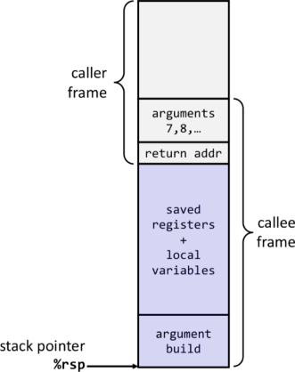

# AMD64 / Intel 64 (x86-64) Architecture

This document provides a minimal introduction to the AMD64 / Intel 64 instruction set and calling convention. Intel provides detailed manuals for its 64 and 32 bit architectures:
  [Four-Volume Set of Intel® 64 and IA-32 Architectures Software Developer’s Manuals](https://software.intel.com/content/www/us/en/develop/articles/intel-sdm.html#three-volume)
 
[Volume 2](https://software.intel.com/content/dam/develop/external/us/en/documents-tps/325383-sdm-vol-2abcd.pdf) contains the complete instruction set reference for Intel 64 processors.


## 1. Registers
Intel 64 has 16 general-purpose registers, fifteen of which can be used more or less arbitrarily.
```
rax, rbx, rcx, rdx, rsi, rdi, rbp, rsp, r8-r15
```

`rsp` is the stack pointer that always points to the top of the stack. `rbp` is sometimes used as a frame pointer to simplify accessing arguments and locals. The other registers can be used freely with a few exceptions - for example, multiplication and division use predefined registers. x86_64 is fully backwards compatible and allows access to the old 8, 16, and 32-bit parts of the registers.

Not visible here are two important registers: the program counter (`rip`) and the condition codes. The program counter is manipulated indirectly through control-flow instructions, and the condition codes are set/read implicitly by ALU operations and conditional branches.


## 2. Instructions
The following instructions suffice to implement a simple code generator for SnuPL/2. We use GCC to assemble our programs, hence the assembler syntax below uses the AT&T syntax. In AT&T syntax, the source is listed before the destination, immediate values are prefixed with "`$`", and registers are prefixed with the "`%`" character.

Memory addresses have the form 
```
  displacement(%base, %index, scaling factor)
```
and access location
```
  mem[%base + %index * scaling factor + displacement]
```
We only use two sub-forms: `disp(%rip)` to access globals in a PC-relative fashion and `disp(%rsp)` (or `disp(%rbp)` if we use a frame pointer) to access variables on the stack.

<table>
  <thead>
    <tr><td>              Instruction              </td><td>                Effect              </td><td>                Description              </td></tr>
  </thead>
  <tbody>
    <tr><td> <code>addl/q  S, D</code>     </td><td> <code>D ← D + S</code>                            </td><td> 32/64-bit addition                     </td></tr>
    <tr><td> <code>subl/q  S, D</code>     </td><td> <code>D ← D – S</code>                            </td><td> 32/64-bit subtraction                  </td></tr>
    <tr><td> <code>andl/q  S, D</code>     </td><td> <code>D ← D && S</code>                           </td><td> 32/64-bit logical and                  </td></tr>
    <tr><td> <code>orl/q   S, D</code>     </td><td> <code>D ← D || S</code>                           </td><td> 32/64-bit logical or                   </td></tr>
    <tr><td> <code>negl/q  D</code>        </td><td> <code>D ← -D</code>                               </td><td> 32/64-bit negate                       </td></tr>
    <tr><td> <code>notl/q  D</code>        </td><td> <code>D ← ~D</code>                               </td><td> 32/64-bit logical not                  </td></tr>
    <tr><td> <code>imull/q S</code>        </td><td> <code>[(E/R)DX:(E/R)AX] ← [(E/R)AX] * S</code>    </td><td> 32/64-bit signed multiply              </td></tr>
    <tr><td> <code>idivl/q S</code>        </td><td> <code>[(E/R)AX] ← [(E/R)DX:(E/R)AX] / S</code>    </td><td> 32/64-bit signed division              </td></tr>
    <tr><td> <code>cmpl/q  S2,S1</code>    </td><td> <code>[condition codes] ← S1 – S2</code>          </td><td> set condition codes based on the compar</td></tr>
    <tr><td> <code>movl/q  S, D</code>     </td><td> <code>D ← S</code>                                </td><td> 32/64-bit move                         </td></tr>
    <tr><td> <code>cdq</code>              </td><td> <code>[EDX:EAX] ← sign_extend([EAX])</code>       </td><td> sign-extend 32 to 64-bit               </td></tr>
    <tr><td> <code>cqo</code>              </td><td> <code>[RDX:RAX] ← sign_extend([RAX])</code>       </td><td> sign-extend 64 to 128-bit              </td></tr>
    <tr><td> <code>pushq  S</code>         </td><td> <code>[RSP] ← [RSP] – 8<br><code>mem[RSP] ← S</code> </td><td> push S onto stack                      </td></tr>
    <tr><td> <code>popq   D</code>         </td><td> <code>D ← mem[RSP]<br>[RSP] ← [RSP] + 8</code>    </td><td> pop top of stack into D                </td></tr>
    <tr><td colspan="3"></td></tr>
    <tr><td> <code>callq  T</code>         </td><td> <code>push return address<br>continue execution at T</code> </td><td> subroutine call                        </td></tr>
    <tr><td> <code>retq</code>             </td><td> <code>pop return address from stack<br>continue execution at return address</code> </td><td> subroutine return                    </td></tr>
    <tr><td> <code>jmp    T</code>         </td><td> <code>continue execution at T</code>              </td><td> unconditional branch                   </td></tr>
    <tr><td> <code>je     T</code>         </td><td> <code>goto T if condition codes signal</code>     </td><td rowspan="6">  conditional branch         </td></tr>
    <tr><td> <code>jne    T</code>         </td><td> <code>goto T if condition codes signal</code>     </td></tr>
    <tr><td> <code>jl     T</code>         </td><td> <code>goto T if condition codes signal</code>     </td></tr>
    <tr><td> <code>jle    T</code>         </td><td> <code>goto T if condition codes signal</code>     </td></tr>
    <tr><td> <code>jg     T</code>         </td><td> <code>goto T if condition codes signal</code>     </td></tr>
    <tr><td> <code>jge    T</code>         </td><td> <code>goto T if condition codes signal</code>     </td></tr>
    <tr><td colspan="3"></td></tr>
    <tr><td> <code>nop</code>              </td><td>                                    </td><td>  no operation                           </td></tr>
  </tbody>
</table>


For almost all arithmetic instructions, one of the operands (but not both) can be a memory address (a notable exception is the idivl instruction), a register, or an immediate. The other operand is an immediate or a register. Depending on the data type, you may need to use the 32-bit (`l`) or 64-bit (`q`) variant of the instruction.


## 3. Data
Parameters, local variables and temporaries are stored on the stack and addressed relative to the stack and/or base pointer. Global data, however, must be allocated statically. The assembler allows to give names (labels) to junks of data, and you can then use those names directly as operands of instructions. Use the `.long <val>` and `.skip n` assembly directives to allocate an initialized long value or *n* uninitialized bytes of memory, respectively. Do not forget to initialize the meta-data of arrays (dimensions) and the content of string constants.

## 4. Calling convention
Linux follows the ELF x86-64 psABI that defines, among other things, the calling convention, i.e., how function parameters and results are passed. While you can use different calling conventions, we strongly recommend that you use the ELF x86-64 psABI also internally.

The most recent version of the ELF x86-64 psABI can be found [here](https://gitlab.com/x86-psABIs/x86-64-ABI), a compiled copy is [included in the handout](x86-64.ABI.pdf).

The stack grows towards smaller addresses. The stack pointer points to the top of the stack. x86-64 allows to use up to 128 bytes below the stack pointer (the so-called "red zone") without moving the stack pointer.

Parameters to functions are passed in registers and the stack. The exact rules are rather complicated, for our purposes the first six function arguments are passed in registers `rdi`, `rsi`, `rdx`, `rcx`, `r8`, and `r9`. The 7th and further arguments on the stack reverse order. Function return values, if present, are returned in register `rax`. The registers `rbx`, `rbp`, `r12`, `r13`, `r14`, and `r15` are callee-saved and thus must be preserved across function calls. Implicitly, `rsp` is also callee-saved. The following figure illustrates the role of the registers; an illustration of the procedure activation frame is provided on the following page.

| Register | Description               | Register | Description               |
|:---------|:--------------------------|:---------|:--------------------------|
| `rax`    | caller saved/return value | `r8`     | caller saved / argument 5 |
| `rbx`    | callee saved              | `r9`     | caller saved / argument 6 |
| `rcx`    | caller saved / argument 4 | `r10`    | caller saved              |
| `rdx`    | caller saved / argument 3 | `r11`    | caller saved              |
| `rsi`    | caller saved / argument 2 | `r12`    | callee saved              |
| `rdi`    | caller saved / argument 1 | `r13`    | callee saved              |
| `rsp`    | stack pointer             | `r14`    | callee saved              |
| `rbp`    | callee saved              | `r15`    | callee saved              |


## 5. Procedure Activation Frame
The procedure activation frame (PAF) contains the parameters, return address, saved registers, and local variables of a procedure/function. The following illustration is taken from slide 17 in the slide set 11 "The Runtime Environment".


The parameters and the return address are generated by the caller. The arguments to a call are prepared by a series of `mov` and `push` instructions, the return address is implicitly pushed onto the stack by the `call` instruction. Upon entering a function, the callee has to create the remaining parts of the activation frame as follows:
  1. [optional] save rbp by pushing it onto the stack
  2. [optional] set rbp to rsp
  3. save callee-saved registers
  4. generate space on the stack for locals and temporaries by adjusting the stack pointer

Immediately before returning to the caller, the callee needs to restore the callee-saved registers and dismantle the activation frame. This can be achieved by the following steps
  1. remove space on stack for locals and temporaries by setting the stack pointer immediately below the callee-saved registers.
  2. restore callee-saved registers
  3. [optional] restore rbp
  4. issue the ret instruction

To avoid problems with nested function calls, the reference compiler stores all argument in temporary values, then issues the opParam instruction immediately before the function call.

